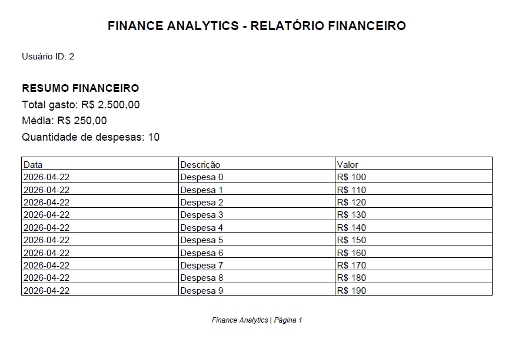
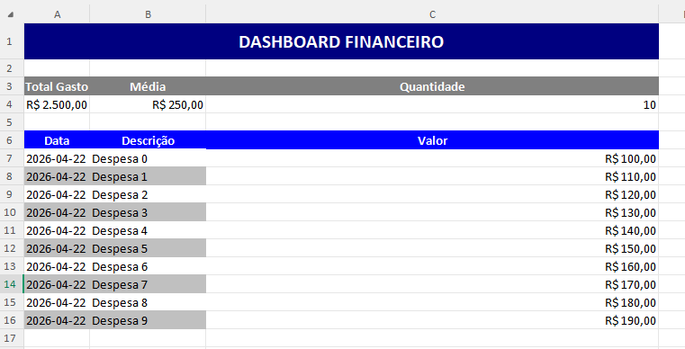

# 📊 Analytics Service

Este módulo é responsável por gerar **relatórios e métricas** com base nas transações registradas no sistema.  
Ainda em desenvolvimento, aqui estarão as regras de cálculo de estatísticas financeiras.

## 🚧 Status

⚠️ Em desenvolvimento — funcionalidades ainda não implementadas.

## Funcionalidades planejadas

- 📈 Total de receitas por período
- 📉 Total de despesas por período
- 🧮 Saldo geral
- 📊 Comparativos mensal/ano
- 🔍 Filtragem por categoria

## Endpoints (planejados)

| Método | Rota | Retorno |
|--------|------|---------|
| GET | `/analytics/summary` | resumo geral |
| GET | `/analytics/month/:ano/:mes` | resumo por mês |
| GET | `/analytics/category` | agrupado por categoria |

## 🛠 Próximos passos

1. Criar entidades / models de relatório  
2. 
   
